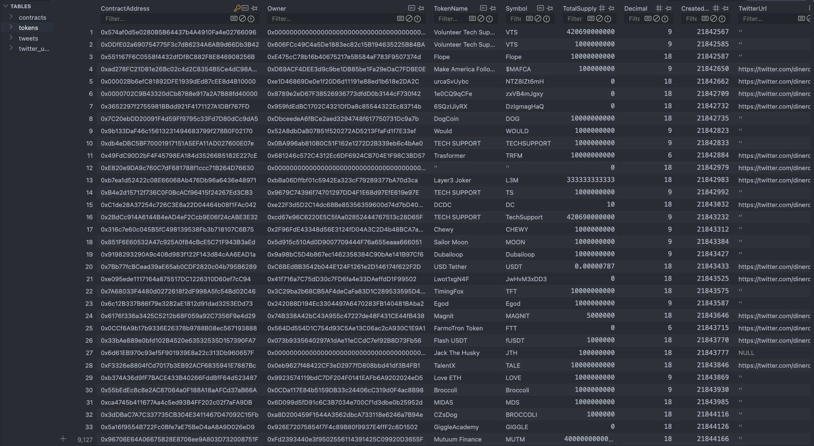
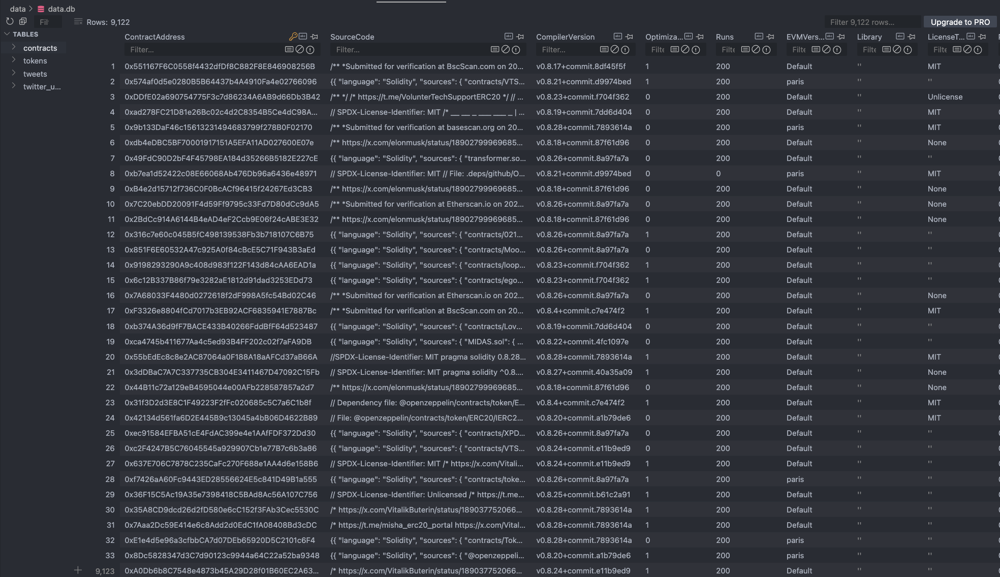
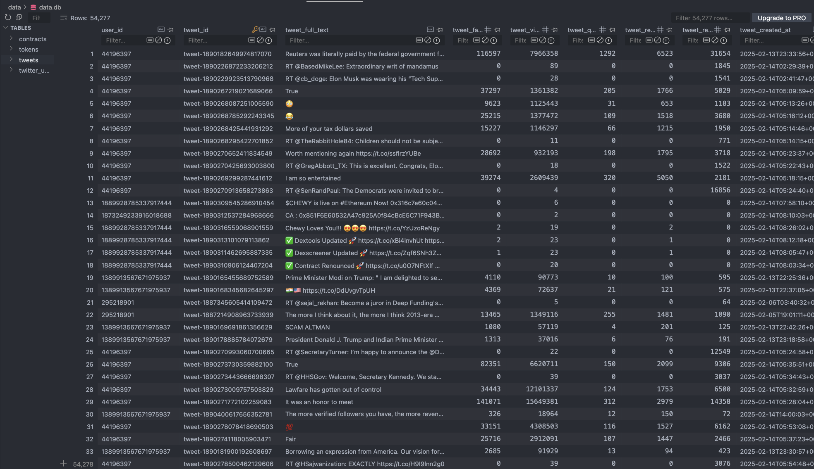
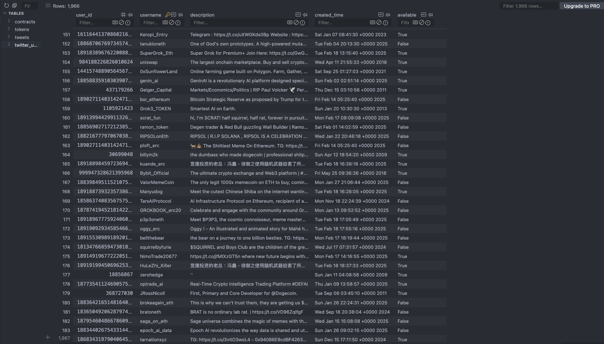

# 数据库结构文档

本文档描述了 ICO-DataHub 项目中的数据库表及其字段。

## 概述

数据库由 `DbManager.py` 管理，使用 SQLite3。它包含四个主要表：
- tokens
- contracts
- tweets
- twitter_users

## 表结构

### Tokens 表
存储加密货币代币及其属性的信息。

关键字段：
- `ContractAddress` (TEXT, 主键)：代币的合约地址
- `pairAddress` (TEXT)：代币对的地址
- `TokenName` (TEXT)：代币名称
- `Symbol` (TEXT)：代币符号 (例如 ETH, BTC)
- `TotalSupply` (INTEGER)：代币总供应量
- `Decimal` (INTEGER)：代币小数位数
- `Owner` (TEXT)：合约拥有者地址

安全相关字段：
- `isSpam` (TEXT)：垃圾状态
- `isPotentialSpam` (TEXT)：潜在垃圾指示
- `safetyLevel` (TEXT)：代币安全评级
- `is_honeypot` (TEXT)：蜜罐状态
- `is_open_source` (TEXT)：开源状态

**表结构示意图**：

---

### Contracts 表
存储智能合约源码及编译细节。

关键字段：
- `ContractAddress` (TEXT, 主键)：合约地址
- `SourceCode` (TEXT)：合约源码
- `CompilerVersion` (TEXT)：Solidity 编译器版本
- `OptimizationUsed` (TEXT)：优化状态
- `EVMVersion` (TEXT)：使用的 EVM 版本

**表结构示意图**：

---

### Tweets 表
存储与代币相关的 Twitter 数据。

关键字段：
- `tweet_id` (TEXT, 主键)：唯一推文标识符
- `user_id` (TEXT)：Twitter 用户 ID
- `tweet_full_text` (TEXT)：推文内容
- `tweet_created_at` (TEXT)：推文创建时间戳
- `tweet_favorite_count` (INTEGER)：点赞数

**表结构示意图**：

---

### Twitter Users 表
存储 Twitter 用户信息。

关键字段：
- `username` (TEXT, 主键)：Twitter 用户名
- `user_id` (INTEGER)：Twitter 用户 ID
- `description` (TEXT)：用户简介
- `created_time` (TEXT)：账户创建时间
- `available` (TEXT)：账户可用状态

**表结构示意图**：

---